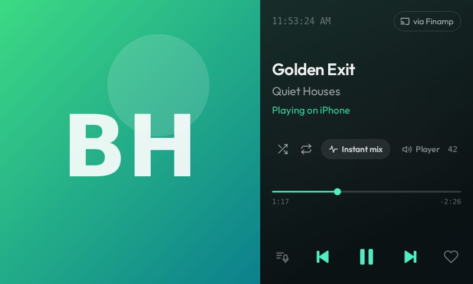
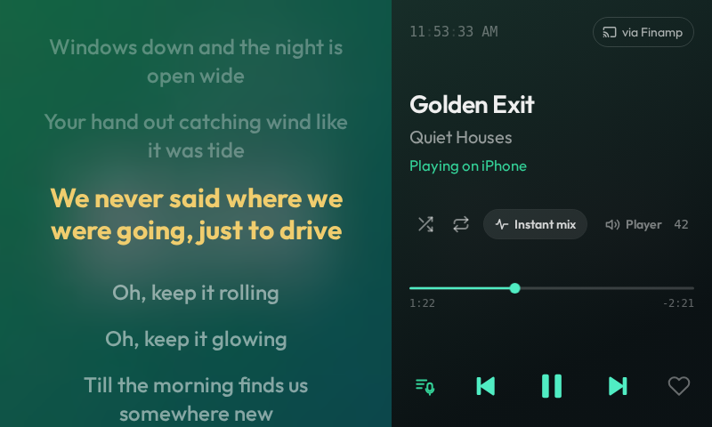

# Finch

A [Jellyfin](https://jellyfin.org) music client for the Spotify Car Thing running
[BridgeThing OS](https://bridgething.com). Browse your Jellyfin music library on
the Car Thing and control playback on any Jellyfin player: the Jellyfin app on
your phone, Jellyfin Web on a TV or laptop, Kodi with the Jellyfin add-on, and so on.




## How it works

```
Car Thing (Finch UI) ──BridgeThing daemon──▶ companion app on phone ──HTTP──▶ Jellyfin server
                                                                                    │
                                    Jellyfin player (phone app / TV / PC) ◀─Sessions API
```

- The Car Thing has no network of its own and no speaker. Every request goes
  through the BridgeThing companion app with `client.net.fetch`.
- Finch is a **remote**: it uses Jellyfin's Sessions API to tell a player
  what to play (`/Sessions/{id}/Playing`), send play/pause/next/seek, and set
  shuffle and repeat. Pick the player in the **Play on** sheet; the choice
  is remembered. The knob turns the phone's own volume (see Volume).
- Sign-in happens once on the phone, in the app's settings page. Only the access
  token is saved to the device config, never the password.

## Features

1.4.0 takes its look and feel from Finch Remote (finch-remote 1.2.1): Outfit
type, top tab strip under the presets, rails of square art tiles, blurred
album-art backdrops tinted with the cover's accent colour, a split Now Playing
screen that folds into a mini player, glass bottom sheets. The remote-control
logic underneath is Finch's own and unchanged from 1.3.1. 1.4.1 brings back
1.3.1's knob highlight, Instant mix buttons and lean rendering, rewrites the
Now Playing fold as a transform-only shared-element animation, and keeps art
and the last lists on the device so screens paint at once after a restart.

- Tabs under the four preset buttons: **Home** (favorite tracks, recently
  added albums), **Playlists** (favorite and all playlists), **Albums**
  (recently added, all albums), **Library** (artists, favorite tracks). Each
  rail has a **See all** grid/list; every tile has a ⋮ menu (touch).
- Detail pages for albums, playlists and artists: big art, **Play**, Shuffle,
  Play next, **Mix** (Instant mix) and Favorite buttons, numbered track list
  with per-row play and ⋮ (touch); artist pages have an **Instant mix** button.
- Context menus: Play next, Add to queue, Add/remove favorite, Start instant
  mix, Go to album / Open.
- Now Playing: art on the left; clock, a "via Finamp" pill (opens **Play on**),
  title, artist, "Playing on iPhone", then lower down the shuffle / repeat /
  **Instant mix** row, the seek bar with times (centred between that row and
  the transport row), and the lyrics / previous / play-pause / next / favorite
  row. Controls and seek bar take an accent colour from the album art (gold
  only when a track has no art). Drag it down (or press Back) for the mini
  player, again for a 4px sliver. Tap or swipe up anywhere in the bottom
  44 px to open the mini player from the sliver; tap the mini player for full.
- Synced lyrics over the art (tap a line to jump there); plain lyrics as text.
  Uses Jellyfin's `/Audio/{id}/Lyrics` (10.9+) with the 10.8 route as fallback.
- **Play on** sheet: every remote-controllable Jellyfin session on your account
  (the old Players screen). Finch is a remote only; there is no on-device audio.
- Playhead: anchored to the first poll that sees each new reported position
  (Finamp reports only about every 150 s), rolled forward while playing.
- Volume (1.4.2, as in finch-remote 1.2.1): the knob always turns the phone's
  volume through the BridgeThing companion (`audio.volumeUp` / `volumeDown`,
  one step per detent, at most one per 90 ms) and the phone shows its own
  volume overlay. Finch draws no volume UI and never sends Jellyfin SetVolume.
- Settings page on the phone: server test, password sign-in, Quick Connect, or API key.

## Controls

| Control | Action |
| --- | --- |
| Preset 1-4 (press) | Home, Playlists, Albums, Library. The tab bar is hidden by default and shows for 1.5 s after a press (setting "Hide tab bar until a preset button is pressed", config key `tabs_autohide`, default on) |
| Hold preset 1 | Now Playing |
| Hold preset 3 | Play on (choose the player) |
| Hold preset 4 | Favorite / unfavorite the current track |
| Knob turn | Move the selection highlight (one song per click in track lists); volume on Now Playing |
| Knob press | Open/activate the highlighted item; play/pause on Now Playing |
| Knob hold (browse screens) | Volume mode for 3 s (turn to change the phone's volume) |
| Back | Close a sheet; Now Playing -> mini player; leave a detail page |
| M | Fold Now Playing, or go Home |
| Touch | Everything is tappable; swipe Now Playing down to fold it; tap or swipe up at the bottom edge to open the sliver |

## Install

1. Install `Finch-1.4.1.zip` from the BridgeThing companion app, the same way
   as any shared webapp zip.
2. Open Finch's **Settings** in the companion app. Enter your server address
   (one your phone can reach, e.g. `http://192.168.1.20:8096`, or a public HTTPS
   address for use away from home), tap **Test connection**, then sign in with
   your password, Quick Connect, or an API key.
3. Open Jellyfin on the device you want to play on. Make sure it allows remote
   control (Jellyfin apps do by default). Choose it under **Play on** (hold preset 3, or tap the "via …" pill).

## Develop

Requires Node 20+ (or Bun).

```bash
npm install
npm run dev            # http://localhost:5173/?demo runs with fake data, no device
npm run typecheck
npm run build          # dist/ (app) + dist/settings.html (companion settings page)
npm run share          # Finch-<version>.zip from dist/
```

`?demo&view=<name>` opens a screen in demo mode: `home`, `playlists`, `albums`,
`library`, `favorites`, `detail` (album), `artist`, `playlist`, `albumlist`,
`now`, `lyrics`, `playon`, `mini`.
To develop against a real device, point the SDK at its daemon:

```bash
VITE_BRIDGETHING_URL=ws://<device-ip>:8891/ npm run dev
```

`bun run push` builds and installs straight onto a Car Thing connected over USB
(`bridgething.local`), then switches the kiosk to the app. `bun run update`
updates the device's BridgeThing release.

## Layout

- `src/App.tsx` - Finch's remote-control state (polling, playhead clock,
  commands; 1.3.1's logic) and knob phone volume (finch-remote's) and the app shell: top tabs, view
  stack, Now Playing sheet, Play on sheet, knob/preset/back handling
- `src/ui/` - the screens and shared components (`views.tsx`,
  `NowPlaying.tsx`, `PlayOnSheet.tsx`, `components.tsx`), and `playback.ts`,
  the context that hands App's state and commands to the screens
- `src/fx/` - knob input (`knob.ts`), knob focus + 1.3.1 selection highlight (`focus.tsx`), glass panels (`glass.tsx`)
- `src/accent.ts` - accent colour sampled from album art
- `src/art.ts` - artwork loader (blob URLs through the phone, 4 at a time; disk cache first)
- `src/persist.ts` - on-device cache: art bytes (IndexedDB, 12 MiB LRU) and the
  last-loaded lists (IndexedDB + a copy in the daemon key-value store)
- `src/blur.ts` - pre-blurred 36 px backdrops (no live CSS blur)
- `src/jellyfin.ts` - Jellyfin REST client over `client.net.fetch`
- `src/demo.ts` - fixtures for `?demo`
- `settings/` - companion-side settings page (Preact, single-file build)
- `public/manifest.json` - webapp id, name, icon, config keys, permissions
- `public/icon.png` - app icon (384 px, ≤64 KiB; source in `branding/open-beak-1024.png`); `public/fonts/` - Outfit + Noto Sans Devanagari
- `scripts/limits.ts` - device limits; the builds and `npm run share` fail
  when the icon is over 64 KiB, the settings page over 1 MiB or the overlay over 512 KiB

Bump `version` in `package.json`, `public/manifest.json` and `APP_VERSION` in
`src/jellyfin.ts` for a release. Never change the manifest `id`.

## Notes

- Shuffle and repeat only work on players that support those remote
  commands; Finch shows a message when a player refuses.
- A queue sent from Finch is capped at 150 tracks around the one you picked
  (URL length limits on some reverse proxies).
- Finch is unofficial and not affiliated with the Jellyfin project.
